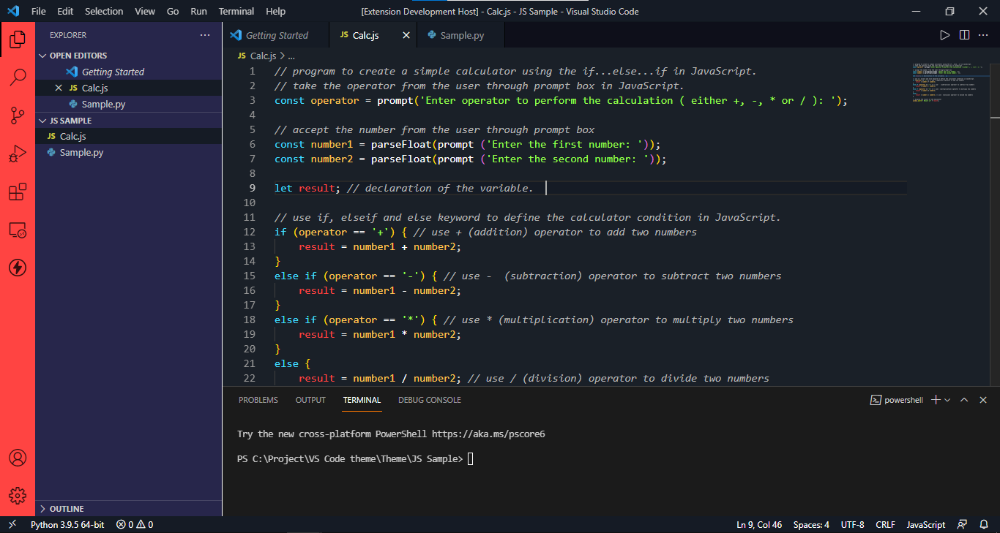
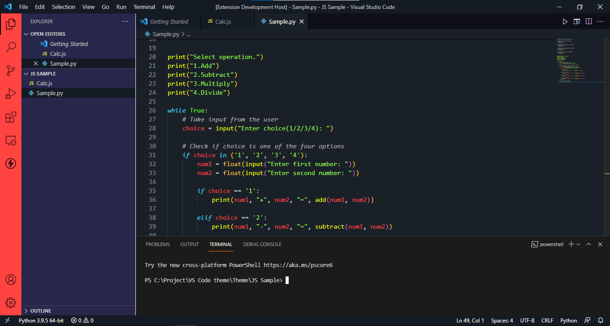

# Prajwal's Ultimate Theme
## About this theme
Hello, I am a young innovator and programmer named Prajwal NH. I have been using the VS Code default theme for a long time. However, one fine day I saw a theme that struck my eye. It was the theme that Hitesh Choudhary Sir used in his tutorials. I loved it and tried finding the same in the marketplace. Sadly, I was not able to find a theme like his. I didn't let this stop me. I went on to create my own theme inspired from Hitesh Sir. Here it is!  

> Theme: Dark  
> Code: bright and colourful!  

 

## Feedback
Please Click [here to give a Feedback on this theme](https://forms.gle/DMXR34sknV3PAW7FA) so that we can make this better!

 

## Theme Preview

### JavaScript:
  

 

### Python:

 

## Updates Coming Up:
* Need to revise the HTML Syntax Colour Palette
* Different Syntax Colour Theme options

 

## Contact Developer

 

[My Website](https://www.prajwal-iimb.com/)

  

## Some Awesome Add-on Extensions
* [Bracket Pair Colorizer 2](https://marketplace.visualstudio.com/items?itemName=CoenraadS.bracket-pair-colorizer-2)

 

## Enjoy!
